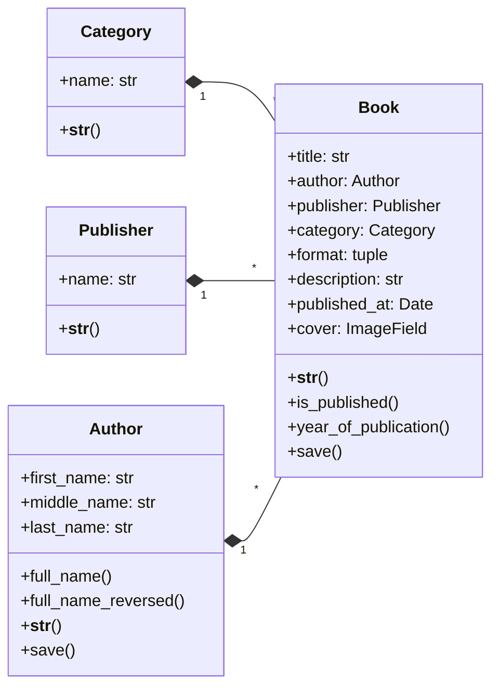
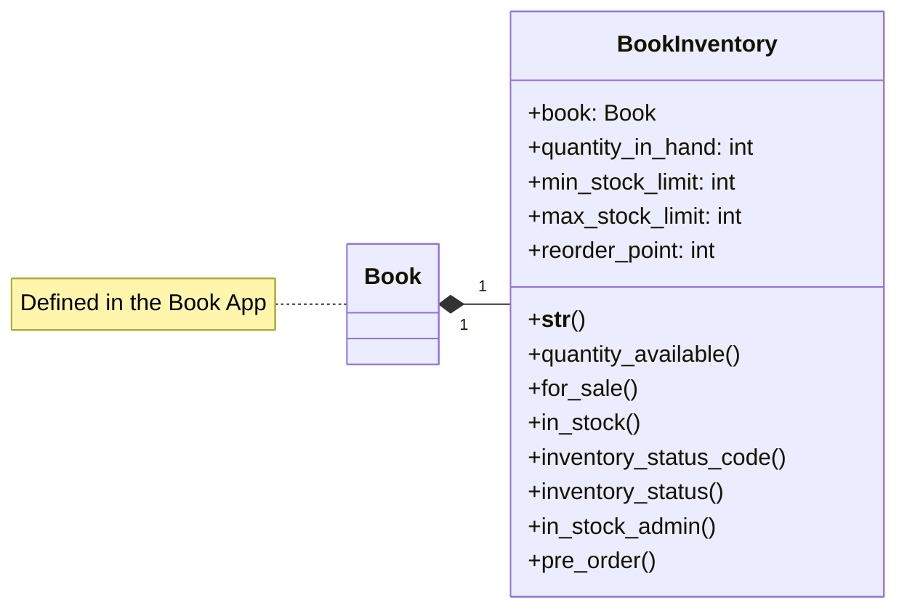

## Book App

```mermaid
classDiagram
    direction LR
    class Category{
      +name: str
      +__str__()
    }
    class Publisher{
      +name: str
      +__str__()
    }
    class Author{
      +first_name: str
      +middle_name: str
      +last_name: str
      +full_name()
      +full_name_reversed()
      +__str__()
      +save()
    }
    class Book{
      +title: str
      +author: Author
      +publisher: Publisher
      +category: Category
      +format: tuple
      +description: str
      +published_at: Date
      +cover: ImageField
      +__str__()
      +is_published()
      +year_of_publication()
      +save()
    }
    Category "1" *-- "*" Book
    Publisher "1" *-- "*" Book
    Author "1" *-- "*" Book
```

## Store App

```mermaid
classDiagram
    direction LR
    class Book
    note for Book "Defined in the Book App"
    class BookInventory{
        +book: Book
        +quantity_in_hand: int
        +min_stock_limit: int
        +max_stock_limit: int
        +reorder_point: int
        +__str__()
        +quantity_available()
        +for_sale()
        +in_stock()
        +inventory_status_code()
        +inventory_status()
        +in_stock_admin()
        +pre_order()
    }
    Book "1" *-- "1" BookInventory
```
