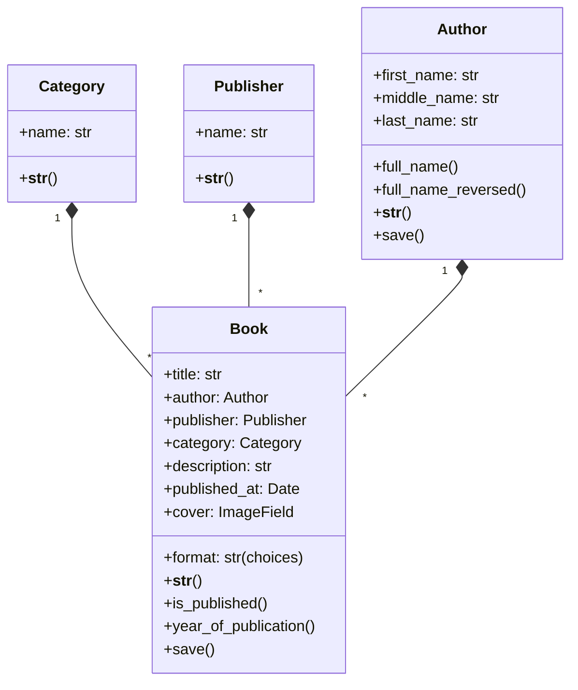

## Book App

```mermaid
classDiagram
    class Category{
      +name: str
      +__str__()
    }
    class Publisher{
      +name: str
      +__str__()
    }
    class Author{
      +first_name: str
      +middle_name: str
      +last_name: str
      +full_name()
      +full_name_reversed()
      +__str__()
      +save()
    }
    class Book{
      +title: str
      +author: Author
      +publisher: Publisher
      +category: Category
      +format: str (choices)
      +description: str
      +published_at: Date
      +cover: ImageField
      +__str__()
      +is_published()
      +year_of_publication()
      +save()
    }
    Category "1" *-- "*" Book
    Publisher "1" *-- "*" Book
    Author "1" *-- "*" Book
```
