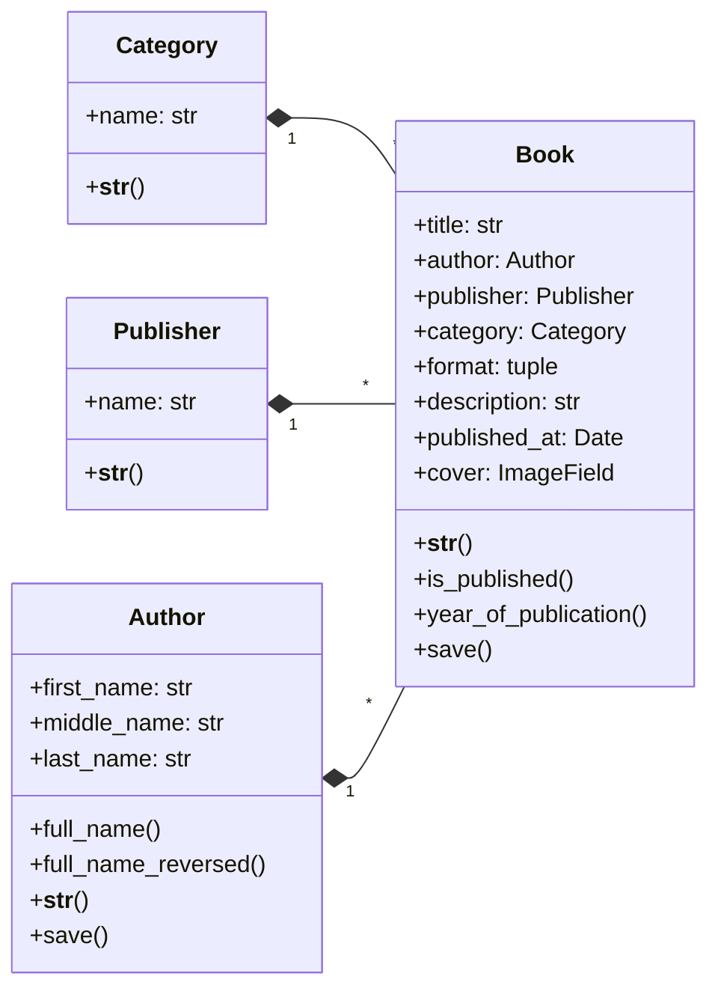

## Books Models

## Related Signals

- **Book Created → Triggers BookInventory Creation**  
  When a new `Book` instance is created, a signal automatically creates a corresponding `BookInventory` entry.  
  (See [Signals Documentation](docs/signals.md) for details.)
