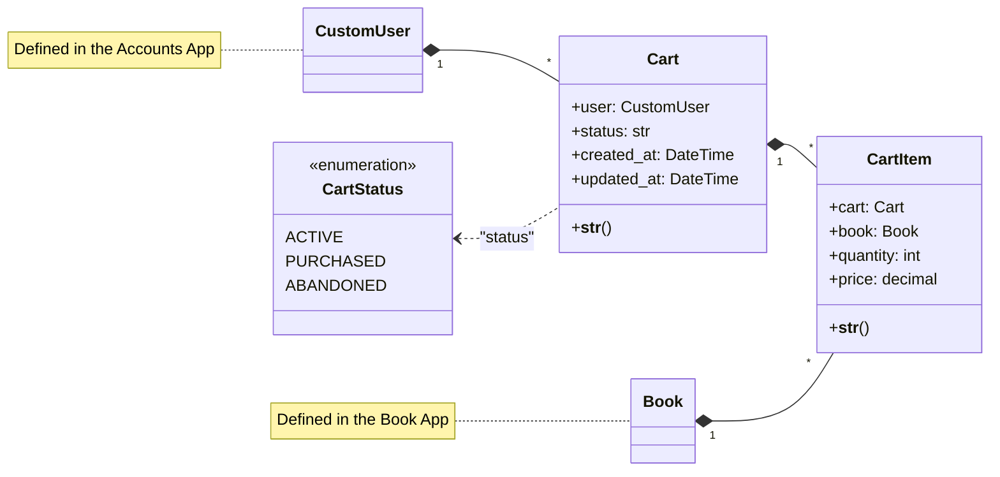

## Carts App

```mermaid
classDiagram
    direction LR
    class CustomUser
    note for CustomUser "Defined in the Accounts App"
    class Book
    note for Book "Defined in the Book App"
    class Cart{
        +user: CustomUser
        +status: str
        +created_at: DateTime
        +updated_at: DateTime
        +__str__()
    }
    class CartItem{
        +cart: Cart
        +book: Book
        +quantity: int
        +price: decimal
        +__str__()
    }
    class CartStatus{
        <<enumeration>>
        ACTIVE
        PURCHASED
        ABANDONED
    }
    CustomUser "1" *-- "*" Cart
    Cart "1" *-- "*" CartItem
    Book "1" *-- "*" CartItem
    CartStatus <.. Cart : "status"
```

**Constraints:**
- Only one active `Cart` per `User`
- `User` can be NULL only if `Cart` is `ABANDONED`
