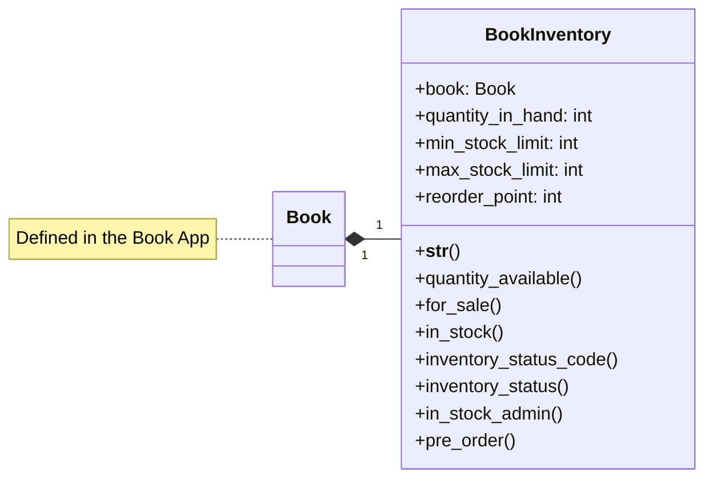

## Store App

## Related Signals

- **Created by Signal**  
  `BookInventory` instances are automatically created when a new `Book` is added.  
  (See [Signals Documentation](../signals.md) for details.)
