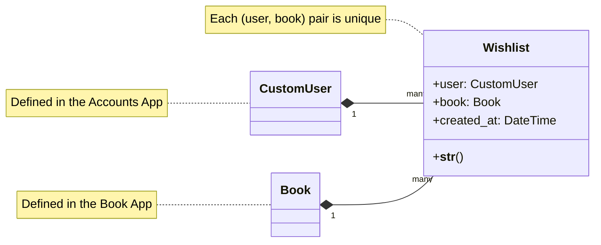

## Wishlist Model

```mermaid
classDiagram
    direction LR
    class CustomUser
    note for CustomUser "Defined in the Accounts App"
    class Book
    note for Book "Defined in the Book App"
    class Wishlist{
        +user: CustomUser
        +book: Book
        +created_at: DateTime
        +__str__()
    }
    note for Wishlist "Each (user, book) pair is unique"
    CustomUser "1" *-- "many" Wishlist
    Book "1" *-- "many" Wishlist
```
