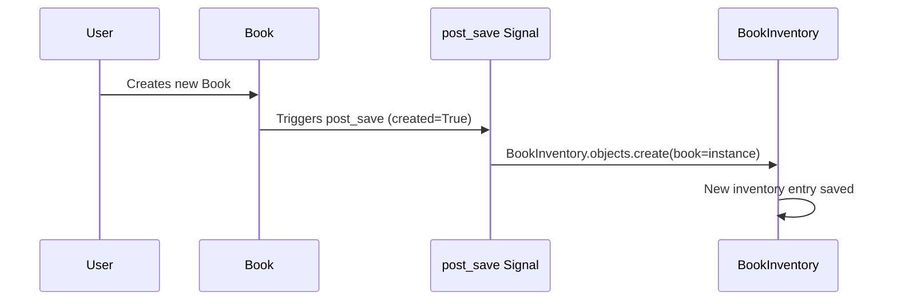

## Signals
### Automatic Inventory Creation
When a new book is created, the system automatically creates an inventory entry.

```mermaid
sequenceDiagram
    participant User as User
    participant BookModel as Book
    participant Signal as post_save Signal
    participant InventoryModel as BookInventory

    User ->> BookModel: Creates new Book
    BookModel ->> Signal: Triggers post_save (created=True)
    Signal ->> InventoryModel: BookInventory.objects.create(book=instance)
    InventoryModel ->> InventoryModel: New inventory entry saved
```
